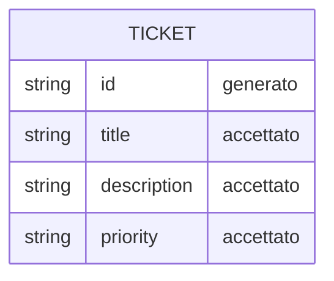

# Data Sketch - Create Ticket

## Prima Di Compilare

Un data sketch e' una classificazione dei campi prima dello schema definitivo.

Serve a decidere quali dati sono accettati, generati, respinti o ancora mancanti.

Il Mermaid finale visualizza solo campi e relazioni gia' motivati nella tabella.

Non usare questo file per progettare tutto il database o accettare campi non collegati a issue e contract.

## Come Scegliere Lo Stato Del Campo

| Stato | Usalo quando | Domanda di controllo |
| --- | --- | --- |
| accettato | il campo arriva dall'input e serve al primo slice | chi lo inserisce? |
| generato | il sistema crea il valore | quando viene creato? |
| respinto | il campo e' fuori scope o non motivato | quale vincolo lo esclude? |
| mancante | il campo potrebbe servire, ma manca una decisione | chi deve chiarirlo? |

Se non sai motivare un campo, non metterlo nel Mermaid: lascialo `mancante` o `respinto`.

## Scopo

Classificare i dati prima di chiedere codice.

## Campi

| Campo | Stato | Motivo | Fonte |
| --- | --- | --- | --- |
| `title` | accettato | Campo obbligatorio inserito dall'utente; identifica il ticket creato | contract sketch + issue L05 |
| `description` | accettato | Campo inserito dall'utente; fornisce il dettaglio del problema | contract sketch |
| `priority` | accettato | Campo selezionato dall'utente tra {low, medium, high}; validato lato server | contract sketch |
| `area` | mancante | Potrebbe servire per categorizzare il ticket; ne' L05 ne' il contract sketch lo richiedono nel primo slice | decisione |
| `status` | mancante | Non necessario al primo slice; va deciso se generato dal sistema o selezionabile in uno slice successivo | decisione |
| `id` | generato | Il sistema genera un identificativo univoco per distinguere il ticket nell'elenco | contract sketch (campi attesi) |
| `attachments` | respinto | Esplicitamente escluso da L05 ("Non aggiungere allegati") | issue L05 |
| `owner` | respinto | Richiederebbe autenticazione/autorizzazione, escluse dai non-goal L05 | issue L05 |
| `createdAt` | mancante | Potrebbe servire per ordinamento cronologico, ma ne' L05 ne' il contract sketch lo menzionano | decisione mancante |

## Mermaid Leggero

Usa Mermaid solo per visualizzare la relazione minima. Non trasformarlo in schema DB definitivo.

Campi mostrati nel diagramma:

- `id` — generato
- `title` — accettato
- `description` — accettato
- `priority` — accettato

## Campi Scartati O Rimandati

| Campo | Decisione | Motivo |
| --- | --- | --- |
| `attachments` | respinto | Escluso da L05 ("Non aggiungere allegati") |
| `owner` | respinto | Richiede auth/autorizzazione, escluse da L05 |
| `area` | rimandato | Puo' servire per categorizzazione futura; non richiesto nel primo slice |
| `status` | rimandato | Non necessario al primo slice; da decidere se generato o selezionabile |
| `createdAt` | rimandato | Potrebbe servire per ordinamento; decisione da prendere in L07 |

## Domande Per L07

- Quale file/struttura in memoria conterra' i ticket creati?
- Quale naming per i campi andra' verificato nella codebase esistente?
- `createdAt` e' necessario per il primo slice o si puo' rimandare?
- L'ordinamento dei ticket in elenco e' basato su ordine di inserimento o su timestamp?
- Il componente ticket esistente quali campi si aspetta?
- `area` va gestito come campo libero o enumerato? Chi lo decide?
- `status` e' generato di default ("open") o va deciso in uno slice successivo?
